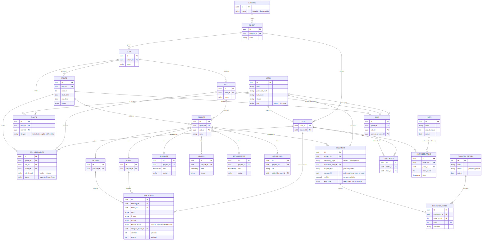
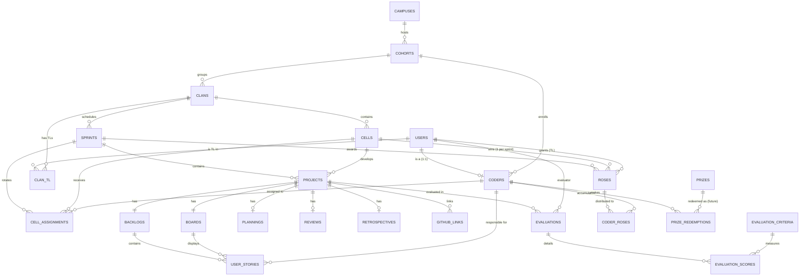

# Modelo de datos — B612

**Audiencia:** Equipo de desarrollo.
**Estado:** Borrador para iterar. **Los campos son indicativos y van a cambiar durante la semana**; lo
estable de este documento son las **entidades y sus relaciones**, no los atributos finales.
**Convención:** nombres de tablas y columnas **en inglés**; el doc se redacta en español.

> Propósito de fondo del sistema: **generar data de empleabilidad** sobre cada coder. Por eso la
> granularidad y calidad de las tablas de evaluación es un requisito core, no un adorno.

---

## Diagrama Entidad-Relación

> Fuente editable en [`data-model.mmd`](./data-model.mmd). Regenerar imagen:
> `npx -y @mermaid-js/mermaid-cli -i docs/data-model.mmd -o docs/data-model.png -b white -s 2`

---

## Entidades por contexto (24)

### Personas e identidad (3)
Modelo híbrido **STI + CTI**: una identidad común con discriminador, más extensión solo donde aporta.
- **users** — identidad/login de todos (coder, TL, admin), con `role` enum (`admin|tl|coder`) como
  discriminador.
- **coders** — extensión 1:1 de `users` para estudiantes; pertenece a una cohorte. Existe porque el
  coder acumula data propia (perfil de empleabilidad, rosas).
- **clan_tl** — asignación M:N de TLs a clanes, con `tl_type` enum (`technical|english|life_skills`).
  Un TL **no tiene tabla propia**: es `users.role = tl`; su tipo y alcance viven aquí. `life_skills` no
  evalúa, es consumidor de data agregada.

### Organización (jerarquía `campus → cohort → clan → cell`) (4)
- **campuses** (*Sede*) — Medellín, Barranquilla. Raíz (se descartó `academia`).
- **cohorts**, **clans**, **cells** — cada cell trabaja con 4 coders (1 leader + 3 rotators),
  materializados por sprint en `cell_assignments`.

### Sprint y rotación (2)
- **sprints** — **anclados al `clan`** (cada clan corre su propio calendario).
- **cell_assignments** — **la rotación**. Asigna cada coder a una cell por sprint con `role_in_cell`
  enum (leader|rotator) y `status` (suggested|confirmed). Resuelve rotación de los 3 y cambio
  excepcional de leader entre sprints, con historia.

### Trabajo (Scrum) (4)
- **projects** — normalmente 1 por (cell, sprint), raramente más. Es la instancia de trabajo de una cell
  en un sprint (de aquí cuelgan board, backlog y ceremonias).
- **backlogs** — 1:1 con project; lista las historias.
- **boards** — 1:1 con project; tablero Kanban donde se muestran las historias por columna.
- **user_stories** — `as_a / i_want / so_that`; `kanban_status` (`todo|in_progress|review|done`).
  Mínimo obligatorio; `estimate` y `priority` opcionales.

### Ceremonias (3)
- **plannings**, **reviews**, **retrospectives** — entidades separadas por project. La review es el marco
  de la evaluación de project; la retro, el de las evaluaciones entre coders.

### Evaluación — unificada (3)
- **evaluation_criteria** — **catálogo configurable** por `scope` (project|person). Criterios aún por
  definir → son data, no columnas.
- **evaluations** — **una sola tabla polimórfica** para los dos tipos de evaluación:
  - `ceremony_type` (review|retrospective) + `subject_type` (project|coder) + `subject_id` polimórfico.
  - Evaluación de **project** (review): `weight` por evaluador (TL technical/english pesan).
  - Evaluación **entre coders** (retro): `eval_type` (peer|self), todos-con-todos + autoevaluación.
- **evaluation_scores** — un score por criterio por evaluación (filas, no columnas). El detalle es
  individual pero **solo se expone agregado**; el evaluador nunca se muestra (anónimo incluso para staff).

### Gamificación e integración (5)
- **roses** — La Rosa a la cell ganadora del sprint; **decisión manual del TL**.
- **coder_roses** — M:N coder↔rose: cada coder **acumula** sus Roses.
- **prizes** — catálogo de premios canjeables. *(Diferible a v2.)*
- **prize_redemptions** — canje de Roses por premio. *(Diferible a v2.)*
- **github_links** — URL de org/repo que el TL pega manualmente, por project.

---

## Invariantes (reglas de negocio del modelo)
- **cell_assignments:** un coder en **una sola cell por sprint**; por (sprint, cell) exactamente
  **1 leader + 3 rotators**.
- **Rotación justa:** un rotator no debería repetir cell/leader en sprints consecutivos → responsabilidad
  del **algoritmo de rotación** (riesgo de producto #1), no un constraint de la DB.
- **evaluations:** `subject_id` es **polimórfico** (no tiene FK estricta); la integridad la garantiza la
  capa de aplicación según `subject_type`. Trade-off aceptado a cambio de unificar la reportería.
- **coder_roses:** al otorgar una Rose a una cell, se reparte a cada coder asignado a esa cell en ese
  sprint (vía `cell_assignments`).

---

## Reducción aplicada (de 29 → 24 tablas)
- Personas: `roles` + `user_roles` + `tl_types` → **enum** en `users`/`cell_assignments`/`clan_tl` (−3).
- Evaluación: `project_evaluations` + `peer_evaluations` (+ sus scores) → `evaluations` +
  `evaluation_scores` (−2).
- Se **mantienen** `backlogs` y `boards` como entidades (decisión de negocio).

## Diferible para v1 (diseñar ahora, migrar en v2)
`prizes`, `prize_redemptions` (canje = v2), y `coder_roses`/`github_links` según entre o no el perfil
público en v1. El **diseño** está completo; las tablas físicas se crean por fases con migraciones, no
todas en v1.

## Fuera del alcance modelado
`refresh_tokens` (revocación de JWT), comentarios/labels de historias, `notifications`, `audit_log`,
columnas de board configurables, y métricas de **inglés** si Riwi lo reactiva.
